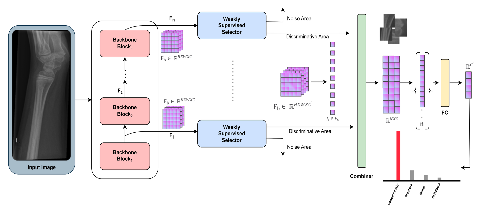
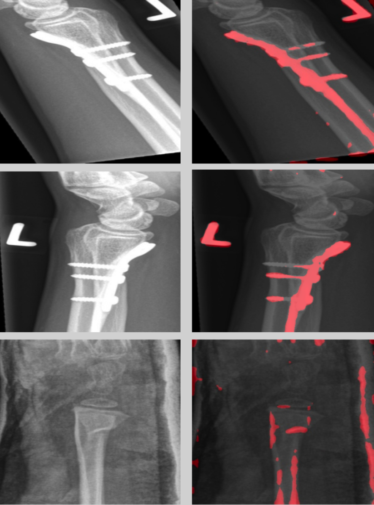

# Learning from the Few: Fine-grained Approach to Pediatric Wrist Pathology Recognition on a Limited Dataset

Paper URL: https://www.sciencedirect.com/science/article/pii/S0010482524011296#aep-article-footnote-id1

We approach wrist pathology recognition as a fine-grained recognition problem. We refine our fine-grained architecture through ablation analysis and the integration of LION optimization. Leveraging Grad-CAM, an explainable AI technique, we highlight these regions. Despite using limited data, reflective of real-world medical study constraints, our method consistently outperforms state-of-the-art image recognition models on both augmented and original (challenging) test sets. Our proposed refined architecture achieves an increase in accuracy of 1.06% and 1.25% compared to the baseline method, resulting in accuracies of 86% and 84%, respectively. Moreover, our approach demonstrates the highest fracture sensitivity of 97%, highlighting its potential to enhance wrist pathology recognition.



-------------------------------------------- 
### **Evaluation Against Other Deep Neural Networks**

| Model          | Test Accuracy (%) |
|----------------|-------------------|
| EfficientNetV2 | 53.59             |
| NFNet          | 65.40             |
| VGG16          | 65.82             |
| ViT            | 70.25             |
| DeiT3          | 70.89             |
| RegNet         | 72.36             |
| DenseNet201    | 73.42             |
| MobileNetV2    | 76.37             |
| CMAL           | 76.58             |
| RexNet100      | 77.43             |
| ResNet101      | 77.43             |
| IELT           | 78.10             |
| DenseNet121    | 78.21             |
| ResNest101e    | 78.27             |
| InceptionV4    | 78.69             |
| MetaFormer     | 78.90             |
| ResNet50       | 79.11             |
| InceptionV3    | 79.54             |
| EfficientNet_b0 | 79.96             |
| YOLOv8x        | 80.50             |
| HERBS          | 82.70             |
| **Our Approach (PIM for FGVR)** | **84.38** |

--------------------------------------------
### **LION Integration and FPN Adjustment**

| Model          | Test Set 1 Accuracy (%) | Test Set 2 Accuracy (%) |
|----------------|-------------------------|-------------------------|
| **PIM**        | 84.38                    | 82.50                    |
| **PIM + LION** | 85.44                    | 83.75                    |

## 1. Environment setting 

### 1.0. Package
* Install Requirements
```
pip install -r requirements.txt
```

### 1.1. Dataset
In this paper, we use a dataset curated from [GRAZPEDWRI-DX](https://www.nature.com/articles/s41597-022-01328-z). The curated dataset can be found at:
* [Curated Dataset](https://figshare.com/s/eb452d2fb36b8ae523c6)

### 1.2. Our Pre-trained Model

The weights of the refined FGVR model can be found at:
* [Weights](https://figshare.com/s/d7c612c26b8a6b51fbe1)

### 1.3. OS
- [x] Windows10
- [x] Ubuntu20.04
- [x] macOS (CPU only)

## 2. Train
- [x] Single GPU Training
- [x] DataParallel (single machine multi-gpus)
- [ ] DistributedDataParallel

(more information: https://pytorch.org/tutorials/intermediate/ddp_tutorial.html)

### 2.1. Data
train, val, and test data structures:  
```
├── train/
│   ├── 0/
│   |   ├── 0/0133_0306769778_07_WRI-R2_M015-1.png
│   |   ├── 0133_0306769778_07_WRI-R2_M015-3.png
│   |   └── ....
│   ├── 1/
│   |   ├── 0025_0483842914_01_WRI-L2_F000.png
│   |   ├── 0053_1119833109_03_WRI-R1_F005.png
│   |   └── ....
│   └── ....
└── val/
│   ├── 0/
│   |   ├── 0133_0306769778_07_WRI-R2_M015-0.png
│   |   ├── 0133_0306769778_07_WRI-R2_M015-2.png
│   |   └── ....
│   ├── 1/
│   |   ├── 0042_0827512771_04_WRI-R2_M015.png
│   |   ├── 0071_0680563744_02_WRI-R1_F009.png
│   |   └── ....
│   └── ....
└── test/
│   ├── 0/
│   |   ├── 0772_0547017117_03_WRI-R1_M017-0.png
│   |   ├── 0772_0547017117_03_WRI-R1_M017-1.png
│   |   └── ....
│   ├── 1/
│   |   ├── 0069_0502540283_01_WRI-L1_M013.png
│   |   ├── 0078_1212376595_01_WRI-L1_M011.png
│   |   └── ....
│   └── ....
└── test2/
│   ├── 0/
│   |   ├── 0772_0547017117_03_WRI-R1_M017.png
│   |   ├── 0834_0240036198_01_WRI-R1_M014.png
│   |   └── ....
│   ├── 1/
│   |   ├── 0069_0502540283_01_WRI-L1_M013.png
│   |   ├── 0115_0432451427_01_WRI-L2_M004.png
│   |   └── ....
│   └── ....
```


### 2.2. Configuration
All the important configuration files are located at [config](./configs/) folder. You can directly modify yaml file if needed.

### 2.3. Run
```
python main.py --c ./configs/wrist.yaml
```
model will save in ./records/{project_name}/{exp_name}/backup/


### 2.5. Multi-GPUs
comment out main.py line 66
```
model = torch.nn.DataParallel(model, device_ids=None)
```

## 3. Evaluation
If you want to evaluate our pre-trained model or your custom-trained model (specify the path to your model in the config file):
```
python main.py --c ./configs/eval.yaml
```
Results will be saved in ./records/{project_name}/{exp_name}/eval_results.txt

## 4. Heatmap Generation
```
python heat.py --c ./configs/wrist.yaml --img data/test/1/0069_0502540283_01_WRI-L1_M013.png --save_img ./0069_0502540283_01_WRI-L1_M013.png
```


## 5. Inference
If you want to reason your picture and get the confusion matrix, please provide configs/eval.yaml 
```
python infer.py --c ./configs/eval.yaml
```
Results will be saved in ./records/{project_name}/{exp_name}/infer_results.txt

- - - - - - 

## Citation

If you find our paper useful in your research, please consider citing:

    @article{ahmed2024learning,
        title     = {Learning from the Few: Fine-Grained Approach to Pediatric Wrist Pathology Recognition on a Limited Dataset},
        author    = {Ahmed, Ammar and Imran, Ali Shariq and Kastrati, Zenun and Daudpota, Sher Muhammad and Ullah, Muhammad and Noor, Waqar},
        year      = {2024},
        journal   = {Computers in Biology and Medicine},
        volume    = {181},
        pages     = {109044},
        url       = {https://doi.org/10.1016/j.compbiomed.2024.109044},
        doi       = {10.1016/j.compbiomed.2024.109044}
}
- - - - - - 

### Acknowledgment

* Thanks to [PIM](https://github.com/chou141253/FGVC-PIM) for their Pytorch implementation of Plug-in Module.

* This work was supported in part by the Department of Computer Science (IDI), Faculty of Information Technology and Electrical Engineering, Norwegian University of Science and Technology (NTNU), Gjøvik, Norway; and in part by the Curricula Development and Capacity Building in Applied Computer Science for Pakistani Higher Education Institutions (CONNECT), Project number: NORPART-2021/10502, funded by DIKU.


